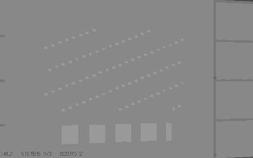
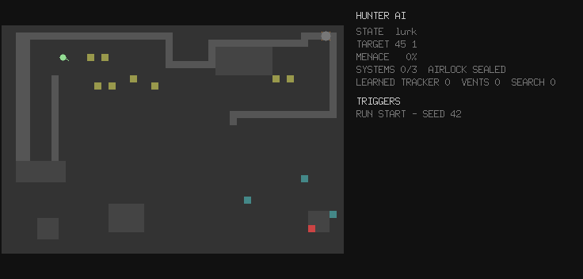

# nemesis

[](https://github.com/danielriddell21/nemesis/actions/workflows/ci.yaml)
[](https://codecov.io/gh/danielriddell21/nemesis)
[](https://go.dev)
[](LICENSE)

A procedurally generated first-person stealth game written in Go with
[Ebiten](https://ebitengine.org/) v2, hunted by an Alien-Isolation-style AI.

Every run drops you into a freshly generated station — rooms and corridors
threaded with crawl-height vent ducts — with one other thing aboard. Bring the
generator consoles online, then reach the airlock, without being caught by a
hunter that hears your footsteps, sees you in the light, stalks you through the
vents, and is quietly steered toward you by a director that always knows where
you are but never tells it exactly. Distract it with a thrown noisemaker, duck
into a locker to break its line of sight, and read the motion tracker whose
ping is itself a sound it can hear. Clear a station and you descend to the
next, deeper deck — against the same hunter, which **remembers what you did**.
Levels are deterministic from a seed.

```
go run ./cmd/nemesis --seed 42
```



## The AI visualiser

A second, optional window shows the hunter's mind while you play: the real
map, its current state and A* path, the director's nudges, and a live trigger
feed ("VENT CREAK AT 12 4"). The game window stays honest — the visualiser is
a separate process fed over a pipe, like a director's commentary track.

```
go run ./cmd/nemesis --visualiser
```

Below, a bot plays while the visualiser records: watch the hunter patrol,
investigate noise ripples, hunt, lose the trail and search — and watch the
LEARNED row climb as it hears tracker pings and vent creaks, remembering
across runs. [How to read everything on screen.](docs/demos.md)



## Install

### Homebrew (macOS)
```sh
brew install --cask danielriddell21/tap/nemesis
```

On Linux/Windows, build from source (`go build ./cmd/nemesis`).

<details>
<summary>Linux: OpenGL/X11 libraries</summary>

The window needs OpenGL/X11. On Debian/Ubuntu:

```sh
sudo apt install libgl1-mesa-dev libxrandr-dev libxcursor-dev libxinerama-dev libxi-dev
```
</details>

## Features

- **Procedural stations** — BSP rooms and corridors carved fresh each run and
  deterministic from a seed, threaded with vent networks dug through the wall
  mass, bulkhead doors, and objective consoles pushed far apart.
- **The hunter** — a two-brain Alien-Isolation-style AI: senses (hearing tiers
  and a light-sensitive vision cone) feed a lurk/patrol/investigate/hunt/search
  state machine over A* paths that prefer the vents; a director paces the
  tension, gestures the hunter toward your neighbourhood without revealing your
  cell, leashes it when it camps, and escalates as generators come online.
- **It learns** — repeat a tactic and the hunter adapts: tracker pings it hears
  stop provoking curiosity and start provoking a sprint, vent crawls teach it
  to check the grates, cold trails sharpen its searches, decoys it walks up to
  stop fooling it, it starts checking the lockers once it has seen you hide, and
  a heat map of past detections pulls its patrols toward your habits. What it
  learns survives into the next deck.
- **Stealth movement** — sneak, walk or run; each gait trades speed against the
  noise the hunter hears. Ducts are slow, dark, claustrophobic — and they creak.
- **Tools** — a raise-to-use **motion tracker** (a bearing/distance blip of
  anything *moving*, painted once per ping — and the ping is a real in-world
  sound); throwable **noisemaker decoys** that fly, land and chirp to draw the
  hunter off; and wall **lockers** you duck into to break its line of sight,
  safe until it wrenches the door open.
- **A descent** — clear a station's generators and escape the airlock to drop
  to the next, deeper deck: more objectives, a warier and quicker hunter, and
  everything it has learned about you carried down with it. One catch ends the
  run.
- **All procedural, no assets** — walls, ducts, consoles and the hunter itself
  are textures synthesised in code; every sound effect and the menace-driven
  ambient bed are rendered PCM.
- **Pure-CPU column raycaster** with per-room gloom, failing light fixtures,
  sliding bulkhead doors, a walking hunter silhouette, and the louvred view
  from inside a locker.
- **Title, pause and settings screens**, positional stereo audio, and run
  history (deepest deck, fastest clear) kept across sessions.

The world, simulation, renderer and audio are pure and headless-testable; only
the Ebiten front-end touches the screen.

## Controls

| Input                  | Action                          |
| ---------------------- | ------------------------------- |
| `W` / `S` (or `↑` `↓`) | Move forward/back               |
| `A` / `D`              | Strafe left/right               |
| Mouse / `←` `→`        | Turn                            |
| `Shift` (hold)         | Run (loud)                      |
| `Ctrl` / `C` (hold)    | Sneak (near-silent)             |
| `T` / right-click (hold) | Raise the motion tracker      |
| `Q` / left-click       | Throw a noisemaker decoy        |
| `F`                    | Hide in / leave a locker        |
| `E` / `Space`          | Use (doors, consoles, airlock)  |
| `Enter`                | Descend / confirm (menus, tally)|
| `↑` `↓` / `←` `→`      | Navigate & adjust menus         |
| `F11`                  | Toggle fullscreen               |
| `Esc`                  | Pause / back                    |

The game opens on a title screen (showing your run history); `Esc` during play
opens a pause menu with settings, rather than quitting outright.

## CLI

```
nemesis [flags]

  --seed int       world seed (0 picks a random seed, printed on start)
  --width int      level width in tiles  (default 48)
  --height int     level height in tiles (default 32)
  --consoles int   objective consoles required to unlock the airlock (default 3)
  --visualiser     open the hunter AI visualiser window alongside the game
```

## Development

```
just build           # compile the binary into ./bin
just run             # build and run
just run-visualiser  # build and run with the AI visualiser
just test            # run all tests
just lint            # golangci-lint
just ci              # lint + test + build
```

## Documentation

- [Architecture](docs/architecture.md) — the layered, headless-testable design.
- [How the hunter thinks](docs/ai.md) — senses, state machine and the director.
- [Demos](docs/demos.md) — how to read the visualiser, and the captures in motion.
