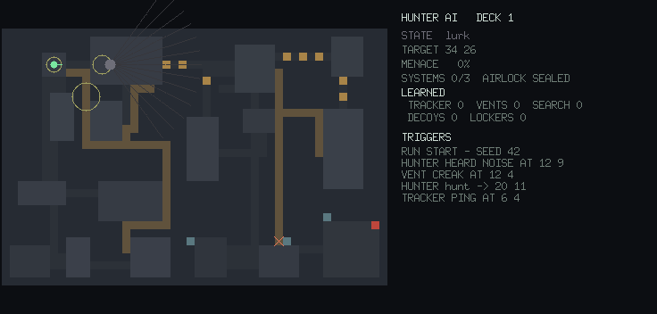

# Demos

A tour of the game and its hunter, in motion. Everything here is generated
programmatically by the committed capture tool (`tools/demogen`) straight from
the simulation and the headless renderers — the same pipeline the game uses. A
scripted pilot plays the objective loop (badly on purpose: it checks its
tracker when scared and dives into vents to escape) while the visualiser
records. Regenerate it all with:

```
just demos        # or: go run ./tools/demogen
```

Every capture runs from a fixed seed, so they are reproducible.

## Watching the hunter think


Roughly two and a half minutes of play at ~3× speed, spanning several runs.
How to read it:

- **The hunter** is the large dot, tinted by its state — grey while it
  **lurks** dormant in a far vent mouth, blue on **patrol**, amber when it
  **investigates** a noise, red on a **hunt**, purple while it **searches**
  after losing the trail. The panel's STATE line names the same thing.
- **Its plan** is drawn as it forms: the small red squares are the remaining
  cells of its current A\* path (watch it thread the brown vent ducts — they
  cost less than corridors), and the orange ✕ is the target the path leads to.
- **The prey** is the small green dot with a facing tick: the scripted pilot
  sneaking, walking and running between the yellow objective consoles, which
  turn green as they come online. The red map tile is the sealed airlock; it
  turns green when every console is lit.
- **Sound is visible**: every noise — footsteps, a bulkhead banging open, a
  tracker ping, a vent creak — expands as a fading yellow ring with the
  loudness the simulation gave it. When a ring reaches the hunter, the feed
  logs `HUNTER HEARD NOISE AT x y` and the state flips to investigate.
- **The director's hand** shows as `DIRECTOR STEERS HUNT TO x y` in the feed:
  it always knows where the prey is, but only ever points at the
  neighbourhood.
- **The trigger feed** on the right is the live event stream — the same
  telemetry the game's audio and HUD consume: `VENT CREAK AT 12 4`,
  `HUNTER SPOTTED PREY AT 41 23`, `PREY KILLED AT 41 23`, `RUN START`.
- **Learning** is the LEARNED row and the red-tinted hot rooms. Tracker pings
  and vent creaks the hunter hears, and hunts that go cold, push the tiers up;
  heat marks the rooms where it keeps detecting prey and pulls its patrols
  there. Watch the row survive `RUN START`: a new station is generated, but
  the same hunter walks into it remembering everything.

## In the corridors


What the same moment feels like from inside: the raycast corridors lit by
each room's own gloom, the hunter's silhouette mid-frame, and the raised
motion tracker — its blip painted once per ping, only for a *moving* contact,
with the chirp audible to more than just you.

## The visualiser at rest



The second window as it opens in play (`nemesis --visualiser`): the true map
with rooms, corridors, ducts, consoles and airlock; actor positions; the
panel's state, target, menace gauge, objective tally and learned tiers; and
the trigger feed filling below.
